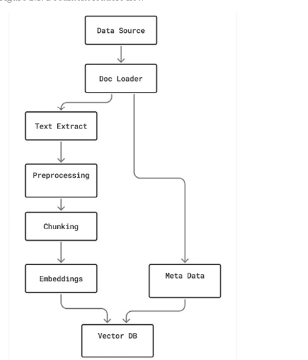

# Document Loaders


## Type Of File Loaders
- *Plain text*: It is a simple structure that requires minimal parsing and is ideal for logs, transcripts, or notes.

- *Markdown files*: Markdown is semi-structured; it has headers and sections. It is popular for technical docs, knowledge bases, and wikis.
```python
from langchain_community.document_loaders import UnstructuredMarkdownLoader

# Load a Markdown file using LangChain's UnstructuredMarkdownLoader
def get_unstructured_markdown_loader():
    mark_down_file_path = "/home/shiva/PycharmProjects/mathematics_zero_to_hero/02_Document_Loaders_For_RAG_Pipelines/document_loader_flow.md"
    unstructured_markdown_loader = UnstructuredMarkdownLoader(file_path=mark_down_file_path)
    markdown_docs = unstructured_markdown_loader.load()
    for markdown_doc in range(len(markdown_docs)):
        print(markdown_docs[markdown_doc].page_content)


if __name__ == '__main__':
    get_unstructured_markdown_loader()

```

- *CSV and Excel*: Tabular documents require row-by-row or column-wise reading. It is useful for structured records like meeting notes, customer tickets, or financial data.
```python
from langchain_community.document_loaders import CSVLoader

# load a CSV file using LangChain's CSVLoader

def get_csv_file_loader():
    csv_loader = CSVLoader("/home/shiva/PycharmProjects/mathematics_zero_to_hero/02_Document_Loaders_For_RAG_Pipelines/currency.csv")
    csv_docs = csv_loader.load()
    for doc in range(len(csv_docs)):
        print(csv_docs[doc].page_content)


if __name__ == "__main__":
    get_csv_file_loader()
```
- *PDF documents*: It is widely used but complex to parse due to the varied layout. It requires handling multi-column text, headers, footnotes, etc.

- *Word documents (DOCX)*: Rich-text files with paragraphs, tables, and metadata. It is important for contracts, policies, and reports.

- *HTML and web pages*: Web-based documents contain rich content with a nested structure.

- *JSON*: Used when data is stored as structured logs, configurations, or returned from external APIs.

